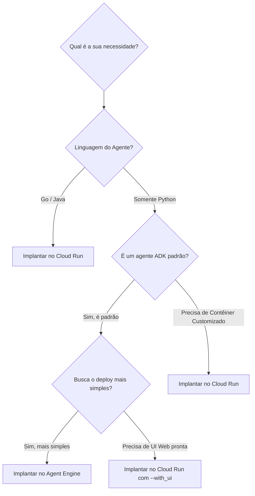

Aqui está o resumo completo e estruturado em **Markdown**, pronto para você copiar e incluir no arquivo `02-solucao-opcoes-de-implantacao-adk.md` no seu GitHub:

# 02. A Solução: Opções de Implantação do ADK

## 🎯 Visão Geral
Para superar a "lacuna do localhost" e disponibilizar os agentes globalmente com alta disponibilidade e persistência, o **ADK (Agent Development Kit)** oferece suporte nativo para duas plataformas de implantação no Google Cloud: **Vertex AI Agent Engine** e **Cloud Run**.

---

## 🛠️ As Opções de Implantação

### 1. Vertex AI Agent Engine
> Serviço totalmente gerenciado do Google Cloud criado especificamente para implantar, gerenciar e escalar agentes de IA em produção sem complexidade de infraestrutura.

* **Comando de Deploy:**
  ```bash
  adk deploy agent-engine \
    --project=my-gcp-project \
    --region=us-central1 \
    --staging_bucket=gs://my-bucket \
    --display_name="My Agent" \
    /path/to/agent
* **Principais Recursos:**
* **100% Nativo do ADK:** Projetado sob medida para o ecossistema de agentes.
* **Sessão Automática:** Configura automaticamente o `VertexAiSessionService` para persistência de estado.
* **Suporte ao Memory Bank:** Integração nativa para histórico e aprendizado contínuo entre sessões.
* **Suporte a Linguagem:** Exclusivo para Python.

---

### 2. Cloud Run

> Plataforma serverless totalmente gerenciada para execução de contêineres escalonáveis.

* **Comando de Deploy:**

```bash
adk deploy cloud_run \
  --project=my-gcp-project \
  --region=us-central1 \
  --service_name=my-agent \
  --with_ui \
  /path/to/agent
```

* **Principais Recursos:**
* **Multi-linguagem:** Compatível com Python, Go e Java.
* **Interface Web Embutida:** A flag `--with_ui` implanta uma interface gráfica interativa pronta para uso.
* **Flexibilidade:** Permite contêineres personalizados e controle detalhado de recursos.
* **Cobrança por Uso:** Modelo serverless (paga apenas quando o agente está sendo executado).


---

## ⚖️ Comparativo: Localhost vs. Implantação na Nuvem

```mermaid
graph TB
subgraph "Desenvolvimento Local"
LOCAL[Seu Computador] --> ADK_WEB[adk web]
ADK_WEB --> LOCALHOST[http://localhost:8000]
LOCALHOST --> YOU[Acesso Restrito ao Desenvolvedor]
LOCAL --> MEMORY[InMemorySessionService]
MEMORY --> LOST[Dados Perdidos na Reinicialização]
end

subgraph "Implantação na Nuvem (Google Cloud)"
CLOUD[Google Cloud] --> AGENT_ENGINE[Agent Engine / Cloud Run]
AGENT_ENGINE --> PUBLIC_URL[[https://agent-xyz.run.app](https://agent-xyz.run.app)]
PUBLIC_URL --> ANYONE[Acesso Público / Equipe / APIs]
CLOUD --> VERTEX_SESSION[VertexAiSessionService]
VERTEX_SESSION --> PERSISTENT[Estado da Sessão Persistente]
CLOUD --> MEMORY_BANK[VertexAiMemoryBankService]
MEMORY_BANK --> CROSS_SESSION[Memória Contínua]
end

```

| Fator | Localhost (Desenvolvimento) | Nuvem (Produção) |
| --- | --- | --- |
| **Acesso** | `http://localhost:8000` (Apenas sua máquina) | URL HTTPS Público (`https://...run.app`) |
| **Disponibilidade** | Apenas quando o terminal está aberto | 24/7 (Alta disponibilidade garantida) |
| **Compartilhamento** | Impossível | URL compartilhável para usuários e equipes |
| **Escalonamento** | Instância única limitada ao computador local

 | Auto-scaling automático na nuvem |
| **Persistência** | `InMemorySessionService` (perde dados)

 | `VertexAiSessionService` (dados persistentes) |

---

## 🌳 Árvore de Decisão: Qual Escolher?



* **Use o Vertex AI Agent Engine quando:** Criar agentes Python padrão do ADK, priorizar o menor esforço de infraestrutura e necessitar de sessão/memória gerenciadas automaticamente.
* **Use o Cloud Run quando:** Necessitar de suporte multi-linguagem (Go/Java), precisar de interface Web nativa (`--with_ui`), contêineres customizados ou controle avançado de infraestrutura.

---

## 📋 Pré-requisitos & Checklist de Configuração (GCP)

1. **Conta & Projeto:** Criar conta no Google Cloud com faturamento ativo e definir o projeto ativo via CLI:
```bash
gcloud config set project ID_DO_PROJETO

```


2. **APIs Necessárias:** Ativar as APIs do Vertex AI e Cloud Run:
```bash
gcloud services enable aiplatform.googleapis.com run.googleapis.com

```


3. **Instalação do SDK:**
```bash
pip install --upgrade google-cloud-aiplatform[adk,agent_engines]>=1.111

```


4. **Alertas de Custo:** Configuração recomendada de orçamentos ($50 / $100) para monitoramento do Nível Gratuito / Créditos.

---